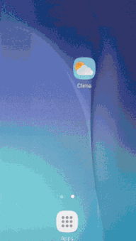

## Clima App

A simple weather app created as part of course module. Introduced concepts such as async http requests as part of android app, 
and Intents. 

Current functionality: 
- App requests location from device, changing every minimum distance or time. Updates city name, temperature, and weather icon
- Button to switch to a new screen
- On new screen, can add custom city name to fetch weather from

# App Demo

